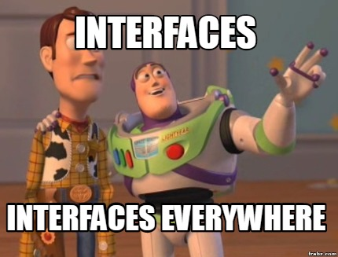

Bora de principios 🚀

# S.O.L.I.D

# S => Single responsability principle
Principio da responsabilidade unica. Cara uma classe/função deve fazer apenas uma coisa, e faze-la bem. Nada de criar funções com multiplas funcionalidades ou criar 'god class' que fazem tudo. 

Separe as coisas, para que cada funcionalidade fique isolada em seu devido lugar, assim o código ficará mais fácil de ser lido e receber sua futura manutenção :3

# O => Open closed principle
Entidades devem estar abertas para extenções mas fechadas para modificações.

Temos o código original, logo tal código não deve ser alterado quando precisamos de novas funcionalidades, ao invés de alterarmos tal código, é mais viavél extender a funcionalidade de alguma outra entidade. 

> Alterar uma classe existente para introduzir uma nova funcionalidade, trás consigo o risco da criação de bugs em tal entidade

Então crie contratos para suas entidades implementarem os comportamento a partir deles. A criação de interfaces é essencial para isso.

Como dito pelo guru Uncle Bob

> Separe o comportamento extensível por trás de uma interface e inverta as dependências.

exemplo: 
```ts
interface CustomerProtocol {
	getName(): string;
}

class Order {
	//Dependa de interfaces
	private readonly customer: CustomerProtocol;

	checkOut(): string {
		return `${this.customer.getName()} seu pedido foi finalizado com sucesso!}`
	}
}

// Aberta para extenções e fechada para modificações
class Customer implements CustomerProtocol {
	private readonly name: string;
	constructor(name: string) {
		this.name = name;
	}
	
	getName(): string {
		return this.name;
	}
}
```

# L - Liskov substitution principle
Se um objeto do tipo X é um subtipo de um objeto do tipo Y, então os objetos do tipo Y devem poder ser substituidos por um objeto do tipo X sem que seja necessário alterar as propriedades do objeto.

Exemplo:
```ts
class Animal {
  constructor(protected _nome: string) {}

  get nome() {
    return this._nome;
  }
}

class Camelo extends Animal {
  private icone = '🐫';

  get nome(): string {
    return `${this.icone} ${this._nome}`;
  }
}
  
class Zebra extends Animal {
  private icone = '🦓';
  
  get nome(): string {
    return `${this.icone} ${this._nome}`;
  }
}
  
const animal = new Animal('Animal');
const camelo = new Camelo('camelo');
const zebra = new Zebra('zebra');
  
console.log(animal.nome);
console.log(camelo.nome);
console.log(zebra.nome);
```

Logo tudo oque um `Animal` faz, sua subclasse faz também. Logo poderiamos alterar os locais que recebem um `Animal`, para receber um `Camelo` ou uma `Zebra`.

# I - Interface segregation principle
Principio da segragação de interface - Uma classe não deve ser forçada a implementar um método que não ira utilizar.

É melhor criar interfaces especificas, ao ivés de criar interfaces genériacas

# D - Dependency inversion principle
Principio da inversão de deprendencia - Entidades não devem depender de classes concretas, mas sim de interfaces/contratos. 

De acordo com o Uncle Bob

> Módulos de alto nível não devem depender de módulos de baixo nível. Ambas devem depender de abstrações

> Abstrações não devem depender de detalhes. Detalhes devem depender de abstrações

Se tratando de POO: 

> Programe para uma interface e não para uma implementação

Logo classes sempre devem implementar uma interface ao invés de implementar uma classe concreta. Dessa maneira, temos um código desacoplado e propicio a testes. 

